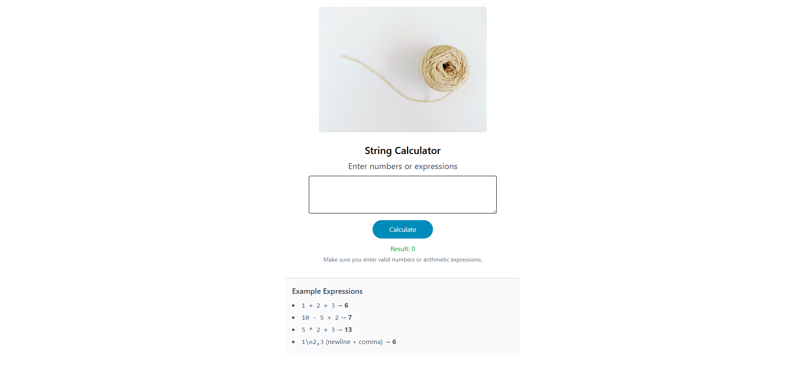
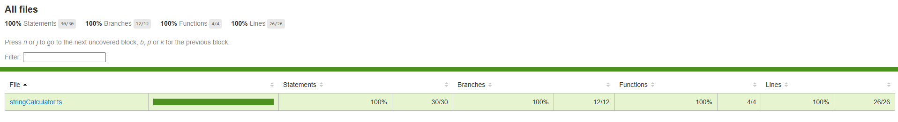
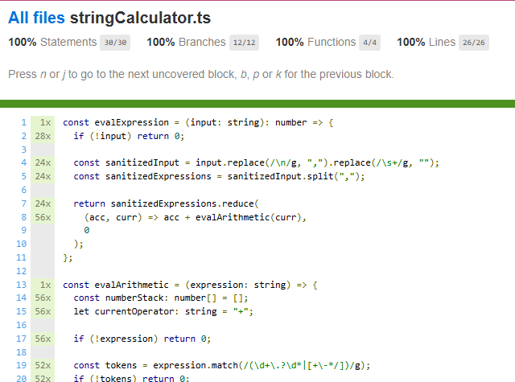

# Incubyte String Calculator Template

## Overview

This project contains a **String Calculator template** built using React. The primary goal is for candidates to implement the functionality and improve accessibility in the provided UI component.

## Project Structure

- **src/**
  - `App.tsx`: The React component with accessibility issues.
  - `stringCalculator.ts`: Implementation of the String Calculator logic (to be developed).
- **tests/**
  - `stringCalculator.test.ts`: Suite of tests for the String Calculator functionality (to be developed).

## Getting Started

1. **Clone the Repository**

   ```bash
   git clone https://github.com/yourusername/string-calculator.git
   cd string-calculator
   ```

2. **Install Dependencies**

   ```bash
   npm install
   ```

3. **Run the Application**

   ```bash
   npm start
   ```

4. **Run Tests**

   ```bash
   npm test
   ```

## Task for Candidates

- Implement the functionality of the String Calculator following TDD best practices.
- Resolve accessibility issues in the `App.tsx`.

## Update

##### Below are the things which are fixed.

- Accessibility issues.
  1.  Color Contrast
  2.  Typography
  3.  Semantics
  4.  Readability (for screen readers)
  5.  Missing Skip to main content button.

##### Improvements made:

- Added Tailwindcss
- Added types.
- Added string evaluation logic based on operators.
- Deployed over vercel.
- Unit Tests (All passing)
- Added vitest coverage to get code coverage.

##### Tools Used to test A11y:

- Windows Narrator.
- SiteImprove plugin.
- Axe Devtools.
- Stylus plugin.

### App Screenshot



### Code Coverage:



